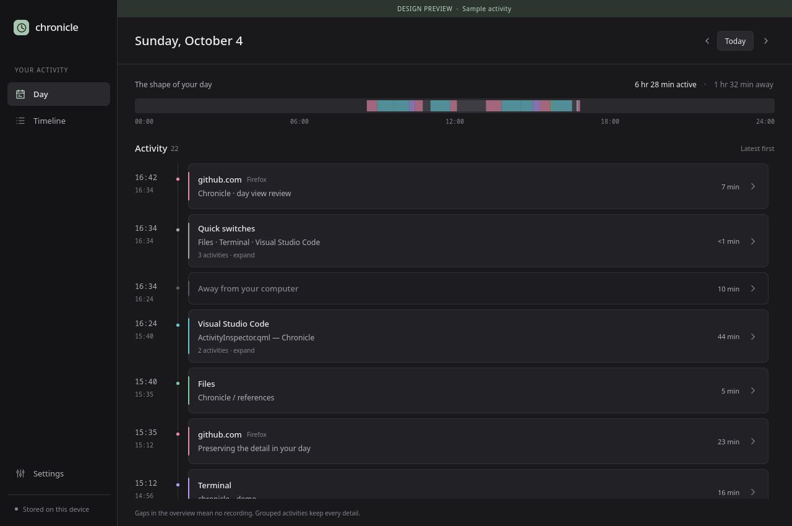

# Chronicle

A local-first desktop history of your computer day, built with Python, PySide6, and QML on top of ActivityWatch.

The current direction is documented in [design-direction.md](design-direction.md). The original [product spec](digital-day-tracker-spec.md) preserves the earlier vision.

## Run

With [uv](https://docs.astral.sh/uv/) installed:

```sh
uv run chronicle
```

ActivityWatch must be running locally at `http://localhost:5600`. Chronicle reads its recorded window, browser, and idle events. It does not modify the recordings.

To preview the interface without ActivityWatch:

```sh
uv run chronicle --demo
```

Demo mode is visibly labeled and uses sample activity. With the existing virtual environment, you can also run `.venv/bin/chronicle --demo`.

## Current experience

- **Day:** latest-first activity groups, an overview of the whole day, and exact details on expansion.
- **Timeline:** searchable chronological history with app, window, and website context.
- **Settings:** local connection and browser-capture information.



## Verify

```sh
QT_QPA_PLATFORM=offscreen PYTHONPATH=src .venv/bin/python -m unittest discover -s tests
QT_QPA_PLATFORM=offscreen QT_QUICK_BACKEND=software PYTHONPATH=src \
  .venv/bin/python scripts/preview.py /tmp/chronicle-preview
```

The second command renders the actual QML interface and checks its main interactions with sample data.
